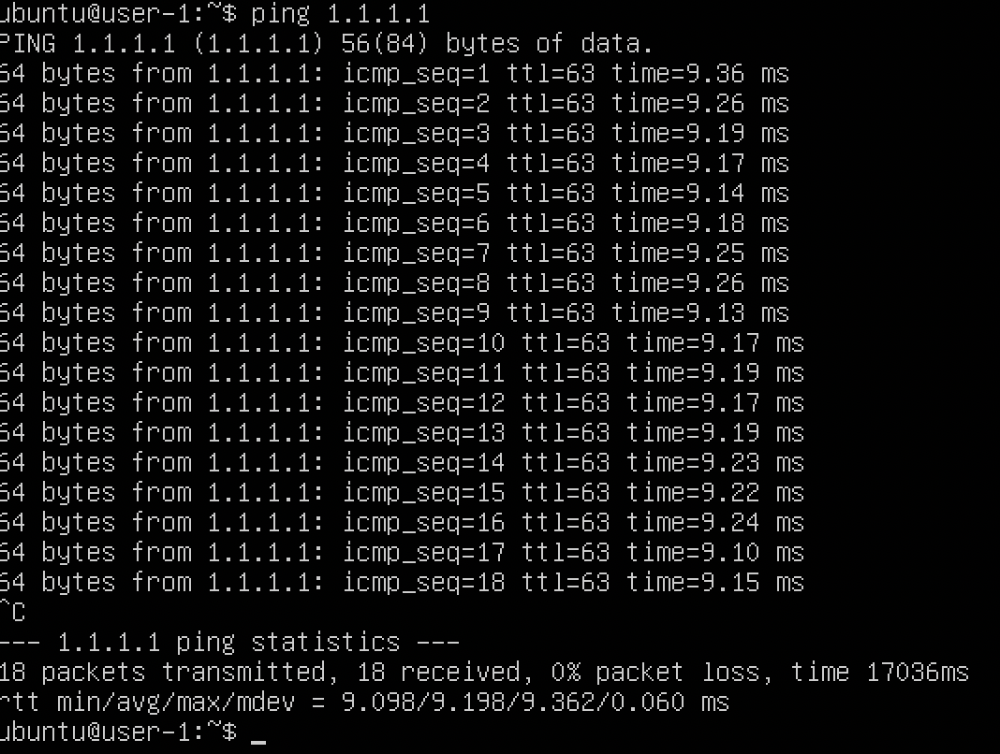
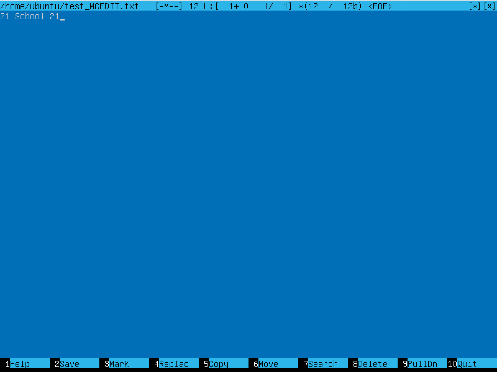

# D01_Linux
report about done project
## Contents
- [D01\_Linux](#d01_linux)
  - [Contents](#contents)
  - [Part 1. Установка ОС](#part-1-установка-ос)
  - [Part 2. Создание пользователя](#part-2-создание-пользователя)
  - [Part 3. Настройка сети ОС](#part-3-настройка-сети-ос)
  - [Part 4. Обновление ОС](#part-4-обновление-ос)
  - [Part 5. Использование команды **sudo**](#part-5-использование-команды-sudo)
  - [Part 6. Установка и настройка службы времени](#part-6-установка-и-настройка-службы-времени)
  - [Part 7. Установка и использование текстовых редакторов](#part-7-установка-и-использование-текстовых-редакторов)
  - [Part 8. Установка и базовая настройка сервиса **SSHD**](#part-8-установка-и-базовая-настройка-сервиса-sshd)
  - [Part 9. Установка и использование утилит **top**, **htop**](#part-9-установка-и-использование-утилит-top-htop)
  - [Part 10. Использование утилиты **fdisk**](#part-10-использование-утилиты-fdisk)
  - [Part 11. Использование утилиты **df**](#part-11-использование-утилиты-df)
  - [Part 12. Использование утилиты **du**](#part-12-использование-утилиты-du)
  - [Part 13. Установка и использование утилиты **ncdu**](#part-13-установка-и-использование-утилиты-ncdu)
  - [Part 14. Работа с системными журналами](#part-14-работа-с-системными-журналами)
  - [Part 15. Использование планировщика заданий **CRON**](#part-15-использование-планировщика-заданий-cron)

## Part 1. Установка ОС
* Для начала скачиваем _VirtualBox_ для того чтобы установить убунту на виртуальную машину.
* Скачиваем образ убунты с вебсайта [сылка на образ](https://ubuntu.com/download/server#downloads)
* Создаем виртуальную машину в _VirtualBox_ и указываем образ
* Следуем пунктам установки, создаем пользователя и перезагураем виртуалку
* Выполняем команду для просмотра версии ОС
```bash
cat /etc/issue
```

* На скриншоте можно увидеть установленную версию ОС
## Part 2. Создание пользователя
* Создаем пользователся задавая ему группу и пароль
```bash
sudo useradd -G adm test
sudo passwd username
```
* Проверяем пользователя
```bash
cat /etc/passwd
```

* На скриншоте можно увидеть нового созданного пользователя
## Part 3. Настройка сети ОС
* Задаем название машины user-1
```bash
sudo hostnamectl set-hostname user-1
```
* Задаем нужную временную зону в интереактивном меню
```bash
sudo dpkg-reconfigure tzdata
```

* На скриншоте можно увидеть установку нужного времени
* Скачиваем net-tools
```bash
sudo apt-get install net-tools
```
* Вывести называния сетевых интерфейсов с помощью консольной команды
```bash
ifconfig
```

* На скриншоте можно увидеть вывод сетевых интерфейсов
* lo или же loopback – так называемая обратная петля. Нужна для того, чтоб машина не отправляла пакеты, адресованные самой себе по сети (например, если на ней стоит сервер БД), а просто возвращала обратно себе (сама она из будет обрабатывать, как пакеты, приходящие из вне
* Так же на скриншоте выше можно увидеть ip адресс полученый от DHCP сервера
* ip – 10.0.2.15 дефолтный адрес для VM. (данные из вывода команды ifconfig)
* DHCP – Dynamic Host Configuration Protocol. Или же протокол динамической конфигурации хоста. Помогает выдавать клиентам сети адреса внутри сети.
* Получаем IP адресс внешнего шлюза
```bash
wget -qO- eth0.me
```

* Ip адресс внешнего шлюза
* Получаем IP адресс внутренего шлюза
```bash
ip route | grep default
```

* Ip адресс внутренего шлюза
* Задать статичные настройки IP, GW, DNS
* Для начала убедимся, что до этого все задавалось не статично
```bash
ip add show
```

* Вывод не статичных настроек
* Войдеи в суперпользователя
```bash
sudo -i
```
* Для того, чтоб задать статические настройки сети на машине нужно открыть файл конфигурации интерфейсов
```bash
nano /etc/netplan/00-installer-config.yaml
```

* Стандартные настройки которые лежат в файле
* Установка статического адреса, маски (24 – 255.255.255.0), шлюза по умолчанию и DNS серверов


* вывод новых настроик
* применяем настройки
```bash
netplan apply
```
* перезагружаем сисетму
```bash
sudo reboot
```
* Проверяем новые настройки


* Новые статичные настройки
* Проверим DNS
```bash
systemd-resolve --status | grep "DNS Server"
```

* Новые настройки DNS
* Пропингуем 1.1.1.1 и ya.ru
```bash
ping 1.1.1.1
```

* Пинг по 1.1.1.1
```bash
ping ya.ru
```

* Пинг по ya.ru
## Part 4. Обновление ОС
* Обновить системные пакеты до последней на момент выполнения задания версии
* Обновим информацию о пакетах
```bash
sudo apt-get update
```

* Информация о пакетах
* Установим пакеты
```bash
sudo apt-get upgrade
```

* Пакеты установлены
## Part 5. Использование команды **sudo**
* Дадим право исполнять sudo новому пользователю которого мы создали
* Давайте посмотри есть ли сейчас у него данное право
```bash
sudo -l -U test
```

* Как видем у пользователя нету данного права
* Выдадим права пользователю
```bash
sudo usermod -aG sudo test
```
* Снова проверим право
  

* Видем что теперь у пользователя есть данное право
* sudo — это важная для понимания утилита, она позволяет временно поднимать привилегии и выполнять задачи администрирования системы. Суть в том, что в каждом дистрибутиве Linux есть пользователь root, имеющий максимальные права
* Поменять hostname от имени вновь вступившего в ряды пользователей с sudo правами
* Сначала зайдем за этого пользователя в систему
```bash
su test
```
* Что ж, давайте теперь поменяем имя машины
```bash
sudo hostnamectl set-hostname test
```
* Проверим имя машины
```bash
hostname
```

* Вот новое имя машины
## Part 6. Установка и настройка службы времени
* Настроить службу автоматической синхронизации времени. Нужно установить демона
```bash
sudo apt-get install systemd-timesyncd
```
* Сделаем его видимым
```bash
systemctl unmask systemd-timesyncd.service
```
* Включим демона
```bash
sudo timedatectl set-ntp yes
```
* Проверим время
```bash
timedatectl show
```

* Готово время синхронизировано
## Part 7. Установка и использование текстовых редакторов 
* Установить текстовые редакторы VIM (+ любые два по желанию)
```bash
sudo apt-get install vim
sudo apt-get install nano
sudo apt-get install mcedit
```
* Используя каждый из трех выбранных редакторов, создайте файл test_X.txt (X – название текстового редактора). Написать в нем свой никнейм и сохранить с применением изменений
* VIM
  

* Написали, но пока еще не сохранили. Чтоб сохранить и выйти esc → :wq
* NANO


* Написали, но пока еще не сохранили. Ctrl + O для сохранения и Ctrl + X для выхода
* MCEDIT


* Нажимаем F2 для сохранения и F10 для выхода
* Используя каждый из трех выбранных редакторов, откройте файл на редактирование, отредактируйте файл, заменив никнейм на строку "21 School 21", закройте файл без сохранения изменений
* VIM


* Чтоб закрыть без сохранения изменений esc -> :q!
* NANO


* Чтоб закрыть без сохранения изменений Ctrl + X -> N
* MCEDIT


* Чтоб закрыть без сохранения изменений F10 и выбрать пункт No в интерактивном окне
* Используя каждый из трех выбранных редакторов, отредактируйте файл ещё раз (по аналогии с предыдущим пунктом), а затем освойте функции поиска по содержимому файла (слово) и замены слова на любое другое
* VIM


* Чтоб найти подстроку в файле – нужно нажать на esc и написать /<word_to_find>


* Чтоб найти и заменить – нужно написать :%s/<word_to_find>/<word_to_change>
* NANO


* Чтоб найти подстроку в файле – Ctrl + W и ввести слово для поиска – как вывод – NANO просто перенесет курсор на первое пересечение


* Чтоб найти и заменить – Ctrl + \ там дальше будет окно, где нужно будет ввести меняемое на меняющее слово
* MCEDIT


* Чтоб найти подстроку в файле – F7 и ввести слово для поиска


* Чтоб найти и заменить – F4 далее вводим что изменить и на что, после его выйдет данное окно


* После замены
## Part 8. Установка и базовая настройка сервиса **SSHD**
* Установить службу SSHd
```bash
sudo apt-get install openssh-server
```
* Добавить автостарт службы при загрузке системы
```bash
sudo systemctl enable sshd
```
* Провери акивна ли служба
```bash
systemctl is-active ssh
```
* Перенастроить службу на 2022 порт
* Чтоб изменить порт SSH нужно зайти в /etc/ssh/sshd_config и раскомментировать строку с портов и поменять порт с 22 на 2022
```bash
sudo nano /etc/ssh/sshd_config
```

* Поменяли порт с 22 на 2022
* Нужно перезагрузить демон SSHd
```bash
sudo systemctl restart ssh
```
* Используя команду ps, показать наличие процесса sshd. Для этого к команде нужно подобрать ключи
```bash
ps aux | grep sshd
```

* ax – будут показаны все процессы. u — выводит пользователя и еще доп информацию. grep выводит только те строчки, где есть sshd
* Перезагрузить систему
```bash
sudo reboot
```
* Посмотрим информацию о портах
```bash
netstat -tan
```

* Видем то что порт 2022 прослушивается
* -t — вывести все tcp порты. -e — вывести все порты. -n — не будет выводить имена. IP-адрес 0.0.0.0 может использоваться на серверах для обозначения того, что служба может связываться со всеми сетевыми интерфейсами. Он дает команду серверу «прослушивать» и принимать соединения с любого IP-адреса.
## Part 9. Установка и использование утилит **top**, **htop**
* Установить и запустить утилиты top и htop
* По выводу команды top определить и написать в отчёте:
* uptime — 16 минут
* количество пользователей — 1
* загрузка системы — 0%
* количество процессов — 25
* загрузка cpu — 0%
* загрузка памяти — 147M
* pid процесса, занимающего больше всего памяти — 646
* pid процесса, занимающего больше всего процессорного времени — 542

* В отчёт вставить скрин с выводом команды htop:
* по PID


* Отсортировано по PID
* по CPU


* Отсортировано по PERCENT_CPU
* по памяти


* Отсортировано по PERCENT_MEM
* отфильтрованному для процесса sshd:


* Отфильтровано по sshd
* с процессом syslog, найденным, используя поиск:


* Найденный syslog
* с добавленным выводом hostname, clock и uptime:


* hostname, clock, uptime
## Part 10. Использование утилиты **fdisk**
* Запустить команду fdisk -l
```bash
fdisk -l
```
* Название диска: VBOX HARDDISK
* Размер диска: 10 Гигабайт
* Количество секторов: 20971520
* Размер swap: 1.5 Гигабайта
## Part 11. Использование утилиты **df** 
* Запустить команду df /
```bash
df /
```
* Размер раздела: 8408452
* Размер занятого пространства: 4273112
* Размер свободного пространства: 3686624
* Процент использования: 54%
* Единица измерения — Килобайты


* Запустить команду df -Th /
```bash
df -Th /
```
* Размер раздела: 8.1 Гигабайт
* Размер занятого пространства: 4.1 Гигабайт
* Размер свободного пространства: 3.6 Гигабайт
* Процент использования: 54%

* Тип файловой системы – ext4

## Part 12. Использование утилиты **du**
* Вывести размер папок /home, /var, /var/log (в байтах, в человекочитаемом виде)
* /home


* в байтах


* в человеческих еденицах)
* /var


* в байтах


* в человеческих еденицах)
* /var/log


* в байтах


* в человеческих еденицах)
* Вывести размер всего содержимого в /var/log


* Вывод внутреностей
## Part 13. Установка и использование утилиты **ncdu**
* Установка ncdu
```bash
sudo apt-get install ncdu
```
* Вывести размер папок /home, /var, /var/log
* /home


* Папка /home выделена
* /var


* Папка /var выделена
* /var/log


* Папка /var/log выделена
## Part 14. Работа с системными журналами
* Открыть для просмотра журнал:
* vim /var/log/dmesg


* журнал dmesg
* vim /var/log/syslog


* журнал syslog
* vim /var/log/auth.log


* журнал auth.log
* Время последней успешной авторизации по логам 16 декабря 19:55


* лог об авторизации в /var/log/auth.log
* Перезапустить службу SSHd
```bash
sudo systemctl restart ssh
```

* Лог о перезапуске в /var/log/syslog
## Part 15. Использование планировщика заданий **CRON**
* Используя планировщик заданий, запустите команду uptime через каждые 2 минуты
```bash
crontab -e
```

* Добавляем в конец файла строку по запуске команды каждые 2 минуты
* Посмотрим логи /var/log/syslog как исполняеться данная команда


* Можно заметить что исполнение происходит каждые 2 минуты
* Вывести на экран список текущих заданий для CRON
```bash
crontab -l
```

* Список задач для CRON
* Удалите все задания из планировщика заданий
```bash
crontab -r
```
* Посмотрим на задачи


* Пустой CRON
